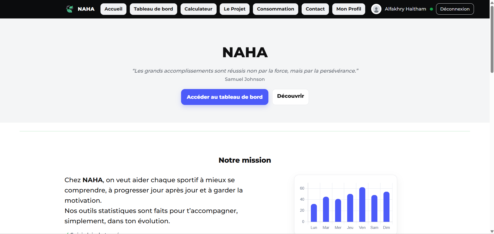
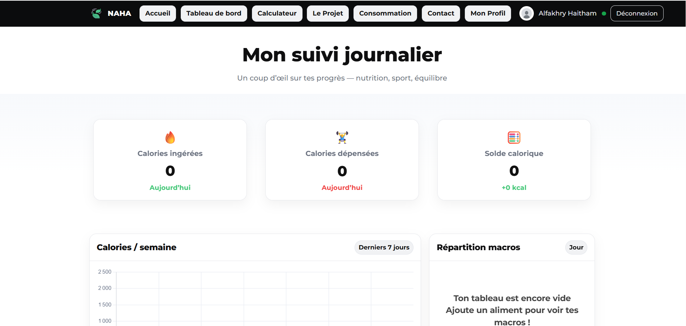
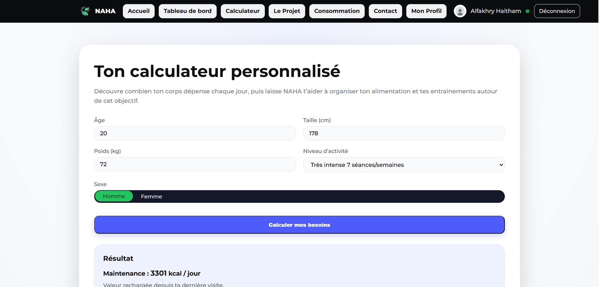
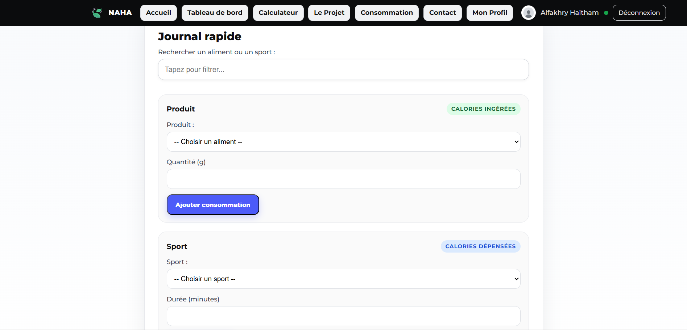
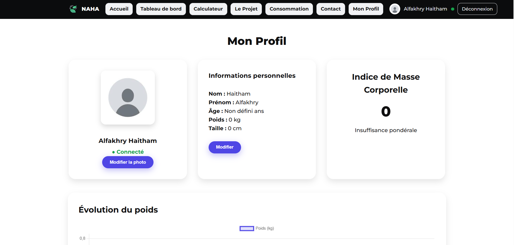

# 🥗 NAHA - Application de Suivi Nutrition & Fitness

## 🇫🇷 Description (Français)

NAHA est une application web moderne dédiée au suivi nutritionnel et sportif.

Elle permet aux utilisateurs de :

- 📊 Suivre leurs calories quotidiennes (ingérées & dépensées)
- 🧮 Calculer leurs besoins caloriques personnalisés
- 📈 Visualiser l’évolution du poids
- 📉 Analyser la répartition des macronutriments
- 👤 Gérer leur profil personnel
- 🎯 Définir et enregistrer des objectifs caloriques
- 📝 Recevoir des conseils quotidiens
- 📬 Contacter l’équipe via formulaire sécurisé

L’objectif principal de NAHA est d’aider chaque sportif à mieux comprendre son corps,
progresser jour après jour et rester motivé grâce à des données claires,
visuelles et actionnables.

NAHA repose sur une approche simple :
📌 Comprendre ses besoins  
📌 Suivre ses actions  
📌 Ajuster progressivement  

---

## 🇬🇧 Description (English)

NAHA is a modern web application designed for nutrition and fitness tracking.

It allows users to:

- 📊 Track daily calories (consumed & burned)
- 🧮 Calculate personalized calorie needs
- 📈 Monitor weight progress
- 📉 Analyze macronutrient distribution
- 👤 Manage personal profile
- 🎯 Set and save calorie goals
- 📝 Receive daily tips
- 📬 Contact the team via a secure form

NAHA’s mission is to help athletes better understand their body,
improve daily habits, and stay consistent through clear and useful data.

---

# 🏗 Project Structure

The application is built using:

- PHP (Back-end logic & sessions)
- MySQL (Database)
- HTML5
- CSS3
- JavaScript (Vanilla JS)
- Chart.js (Statistics & dynamic charts)

Main pages:

- `accueil.php` → Home page
- `seconnecter.php` → Login
- `sinscrire.php` → Registration
- `tableau.php` → Dashboard
- `calculateur.php` → Calorie calculator
- `consommation.php` → Food & sport journal
- `profil.php` → User profile
- `contact.php` → Contact form
- `projet.php` → About the project

APIs & AJAX:

- `login_api.php`
- `register_api.php`
- `save-goal.php`
- `api/get_sports.php`
- AJAX endpoints inside project pages

---

# 📸 Screenshots

## 🏠 Home Page


## 📊 Dashboard


## 🧮 Calorie Calculator


## 📘 Journal


## 👤 Profile


---

# 🛠 Technologies Used

- HTML5
- CSS3
- JavaScript
- PHP 8+
- MySQL
- Chart.js
- Responsive Design

---

# 🔐 Security Features

- Session-based authentication
- Password hashing (password_hash)
- CSRF token protection
- Prepared SQL statements (PDO)
- Server-side validation
- AJAX secure endpoints

---

# 👨‍💻 Recent Updates

The latest major updates and refactoring were made by:

**Haitham Alfakhry**

Improvements include:

- ✔ Restructuring file paths for consistency
- ✔ Standardized CSS & JS integration
- ✔ Secure AJAX endpoints
- ✔ Added CSRF protection
- ✔ Improved dashboard logic
- ✔ Optimized database interactions
- ✔ Cleaned authentication system
- ✔ Unified session handling (id / id_utilisateur compatibility)

These updates improved stability, security, and maintainability of the project.

---

# 📌 Future Improvements

- 🌙 Dark Mode
- 📱 Full mobile optimization
- 🍎 API food database integration
- 📊 Advanced analytics
- 🏆 Achievement system
- 📅 Weekly performance reports
- 🔔 Smart notifications

---

# 🚀 Vision

NAHA is not just a calorie tracker.
It is a personal data-driven fitness companion.

The long-term goal is to build:

- A smart coaching system
- A behavioral motivation engine
- A scalable platform for athletes of all levels

---

# 📁 Recommended Folder Structure

```
NAHA/
│
├── README.md
├── screenshots/
│   ├── home.png
│   ├── dashboard.png
│   ├── calculator.png
│   ├── journal.png
│   └── profile.png
│
├── assets/
│   ├── css/
│   ├── js/
│   └── img/
│
├── api/
│   └── get_sports.php
│
├── accueil.php
├── tableau.php
├── calculateur.php
├── consommation.php
├── profil.php
├── contact.php
├── projet.php
```

---

# 🥗 NAHA

“Les grands accomplissements sont réussis non par la force,
mais par la persévérance.”
— Samuel Johnson